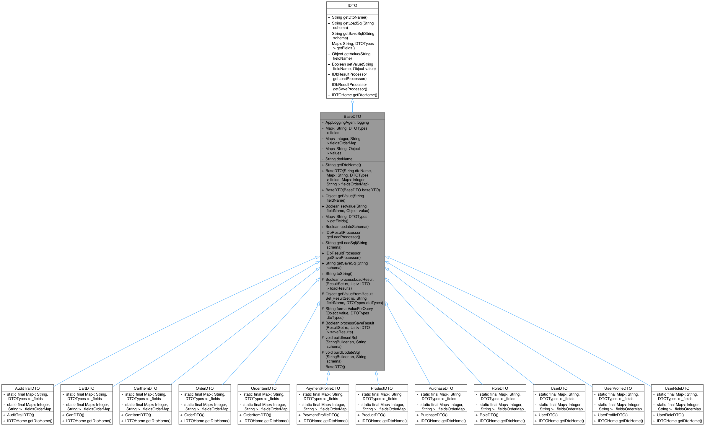
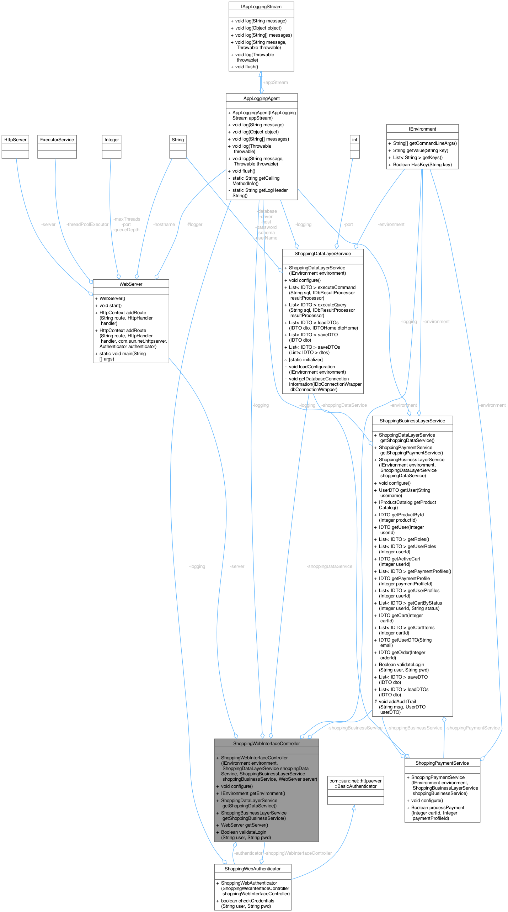

# shopping-system

## Building

To build, run the script to build the project

```
$ buildme.sh
```

The [buildme.sh](./buildme.sh) should setup the paths, build the docker images for Java, Postgres and the running application.
Each time it runs it resets the database to the initial state and reruns the test application which also
provides starting data.
The scripts in `./scripts` directory are used to prep and build the docker images and run the docker application as well as setup the initialization SQL file that Postgres runs on init.
[example_postgres_db.session.sql](./example_postgres_db.session.sql)

## Running

The [docker-compose.yml](./docker-compose.yml) file will start the application and the database. The application will be available on port 8001

The database can be accessed on port 5432 and viewing the [postgres.env](./postgres.env) file will provide the connection information. As well as the [app.properties](./src/app.properties) file.

## JUnit

Junit is build into the docker-compose and will run the tests on startup.
An example of a test is in the [TestDTO.java](./src/TestDTO.java) file.

## Achitecture

The application is built in 3 distinct layers. There is the presentation layer which contains a WebAdapter and is hosted on port 8001
The middle tier is the ShoppingSystem business layer which provides the business logic to the presentation layer. The business layer also uses
the bottom layer, which is the data access layer. This layer interacts with the database and provides the data to the business layer.


[Documentation Link](./docs/html/index.html)

### DTOs

These are used by the data layer to abstract out the database operations


Each DTO has a Home class that provides a singleton instance access to the DTO and shared operations so that the data layer iteractions are consistent.


### WebServer

The web server is based on the provided Oracle classes that host a simple web server. Classes have been added to support cookies, ease of accessing the session data and to provide a simple way to create a host links


The complete picture of the web integrations looks like this:


## Output
